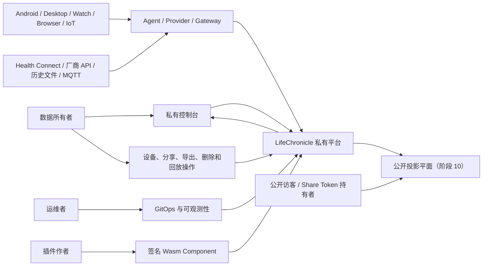
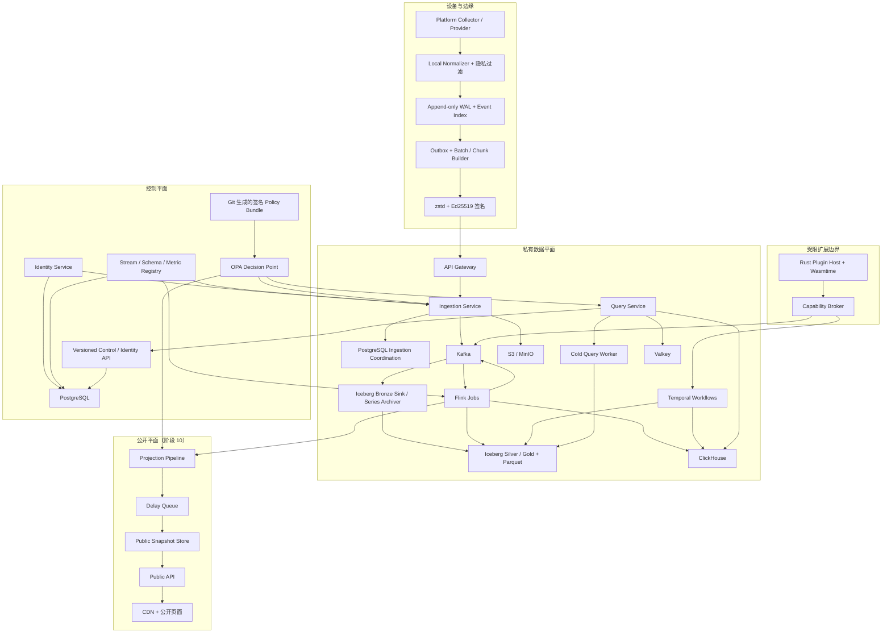
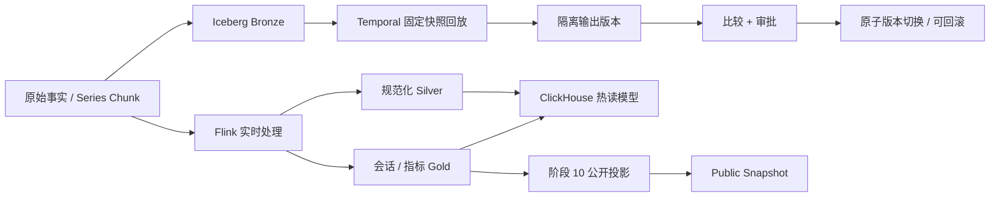
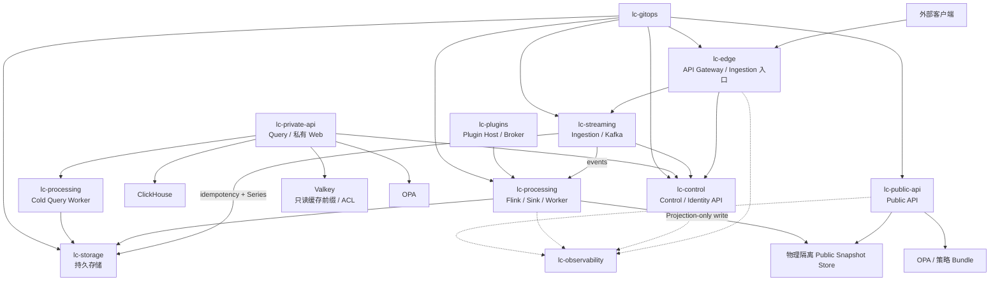
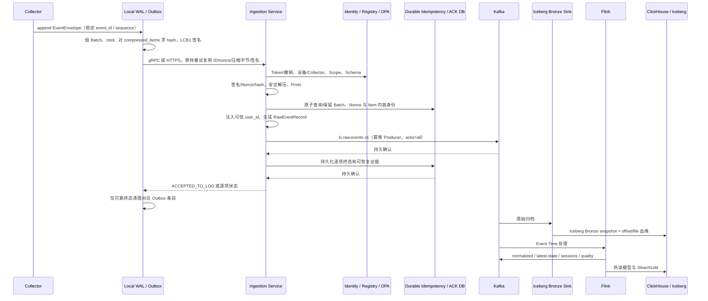
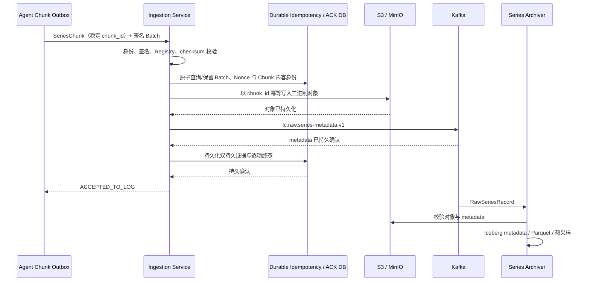
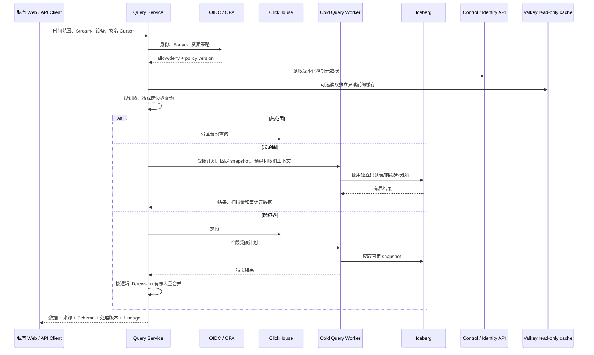
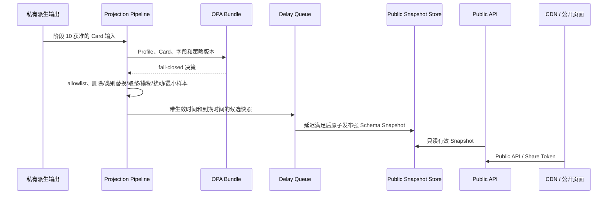
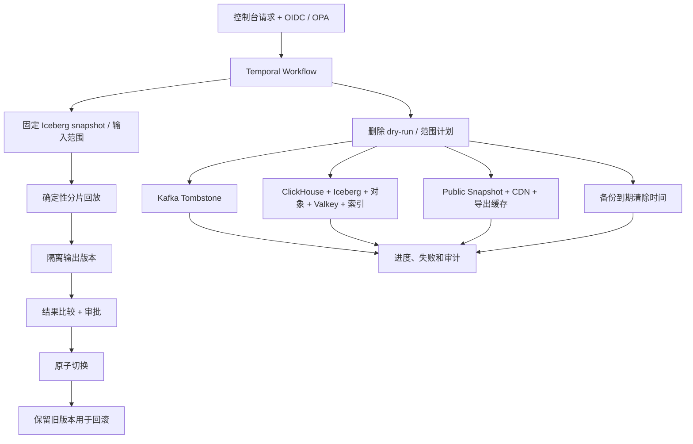

# LifeChronicle 总体架构

**文档版本：** v1.0
**状态：** 阶段 0 已接受架构基线
**适用范围：** 阶段 0–12
**依据与配套契约：**

- [项目工程契约](../contract/project-contract.md)
- [参考项目调研](../research/reference-project-survey.md)
- [项目规划书](../planning/project-plan.md)
- [开发路线图 v2](../planning/development-roadmap.md)
- [事件与 Stream 规范](../protocol/event-stream-spec.md)
- [基础设施部署规范](../operations/infrastructure-deployment-spec.md)
- [聚合任务清单](../planning/tasks/README.md)

## 1. 文档定位与按问题域权威来源

本文定义 LifeChronicle 的系统边界、组件职责、数据所有权、跨组件协议、可靠性与
一致性语义，以及阶段性落地方式。它是实现、ADR、服务设计和验收测试的共同架构
基线，不替代字段级协议、数据库 DDL、运维 Runbook 或具体隐私规则。

权威不是简单的全局优先级或“最后修改者获胜”，而是按问题域确定：

| 问题域 | 权威来源 |
| --- | --- |
| 系统边界、组件职责、数据所有权和信任边界 | 本总体架构 |
| 工程协作、门禁、审批和跨领域不变量 | 项目工程契约 |
| Event、Series、Batch、ACK、Registry、Topic | 事件与 Stream 规范 |
| 环境、GitOps、网络、存储、恢复和基础设施测试 | 基础设施部署规范 |
| 阶段顺序、MVP 和发布范围 | 开发路线图 v2；任务清单只跟踪执行和证据 |
| 产品愿景、长期目标和设计背景 | 项目规划书 |
| 单项重要决策及其理由 | 已接受 ADR，且必须同步受影响的权威文档 |

一项变更跨越多个问题域时，所有对应权威文档必须同时成立，不能选择对实现最方便的
条款。若仍无法消解，暂停受影响的实现或发布，先形成 ADR，再同步规范、迁移和测试。

本文末尾保留本轮一致性审阅与收敛记录，说明曾出现的歧义、最终结论和已经同步的
权威文档；这些记录不是仍可由实现自行选择的分支。

## 2. 目标与非目标

### 2.1 架构目标

LifeChronicle 要形成一个开源、自托管、隐私优先的个人数据平台，并长期保证：

- Android、Desktop、穿戴设备、浏览器和外部源可复用统一身份和数据协议；
- 设备离线时先写本地 WAL，恢复网络后补传，重试不生成新事实；
- 普通事件和高频序列采用不同载荷、存储和处理通路；
- 原始事实不可变、可追溯、可长期归档；
- 处理以 `observed_at` 为业务时间，显式处理乱序、迟到、时钟异常和时区变化；
- 派生结果携带完整 `Lineage`，可在固定输入快照上确定性回放、比较、切换和回滚；
- 热查询、完整历史、控制事务和公开快照各有明确事实源；
- 私有事实与公开服务物理隔离，新 Stream 和新 Card 默认不公开；
- 身份、授权、隐私、删除、导出、审计、备份和恢复形成可自动验证的闭环；
- 从本地 `kind` 到生产 Kubernetes 使用同一套版本化声明和核心数据通路。

### 2.2 非目标

本架构不以以下事项为目标：

- 医疗诊断或自动医疗建议；
- 未经允许采集聊天、通知正文、剪贴板、音频或摄像头内容；
- 默认公开精确位置、健康原始值、窗口标题或其他敏感事实；
- 将一种数据库、一个 JSON 行模型或智能家居 Entity 强行作为全部数据模型；
- 让 PostgreSQL、Valkey、Kafka 或 ClickHouse 单独承担永久档案的全部职责；
- 让 Public API、插件或设备 Provider 绕过统一身份、Schema、WAL/Outbox 和隐私边界；
- 为 MVP 建立以后必须替换的临时核心通路；
- 通过“全局 exactly-once”口号掩盖各层幂等、提交和恢复边界；
- 为形式上的分布式引入没有可验证价值的组件。

## 3. 架构原则与不可破坏的不变量

1. **契约优先。** Protobuf、Stream Registry、Metric Registry、Kafka Key、Topic
   Value、签名 framing、错误码和 ACK 先冻结，再实现 Producer 和 Consumer。
2. **原始事实只追加。** 修正、替代、标注和删除使用 `Correction`、
   `Tombstone`、`Annotation` 及新事实表达，不原地改写原始记录。
3. **设备端本地优先。** Collector 不直接依赖网络；事实先进入本地 append-only
   WAL 和 Outbox，只有可靠 ACK 才允许清理。
4. **事件时间优先。** 派生计算使用 `observed_at`；`received_at`、
   `ingested_at` 和 `processed_at` 只描述处理过程，不替换业务时间。
5. **Event/Series 分离。** `SeriesChunk` 不展开为海量普通事件，也不得进入
   `lc.raw.events.v1`。
6. **原始、派生、公开分离。** 原始事实是档案，派生结果可重建，公开快照是经
   策略和转换产生的最小数据副本。
7. **默认私有和失败关闭。** 新 Stream 默认 `PRIVATE`，新 Card 默认关闭；授权、
   签名验证和公开投影决策失败时不得放行。
8. **明确事实源。** PostgreSQL 负责事务型控制元数据（含接入幂等/ACK 协调），
   Kafka 负责近期持久日志，Iceberg
   负责永久历史，ClickHouse 负责热查询，Valkey 只是可重建的易失状态。
9. **端到端幂等。** `event_id`、`chunk_id`、`batch_id`、Kafka Producer、
   Flink 状态、Sink 业务键和 Temporal `workflow_id` 各守一层，不能互相替代。
10. **固定输入决定输出。** 同一输入快照、处理器版本和规则版本必须产生相同的
    逻辑结果；会话 ID 和 revision 不得依赖随机到达顺序。
11. **边界可替换，语义不可弱化。** 组件实现可以经 ADR 替换，但替代方案必须
    保持协议、恢复、隔离、可观测性和验收语义。
12. **发布质量门决定能力启用。** 阶段 3–8 的 MVP 保持完全私有；公开投影只在
    阶段 10 的隔离与隐私质量门通过后启用。

## 4. 参考项目对架构的约束

| 参考 | 借鉴 | 明确不继承 |
| --- | --- | --- |
| ActivityWatch | Watcher 与服务端解耦、Heartbeat、前台/Idle 关联、时间范围查询 | Bucket 不同时承担身份、权限和 Schema；补齐签名、长期离线、Kafka、数据湖和 Series |
| Home Assistant Recorder | 当前状态、短期历史、长期统计和保留分层 | 不以 Entity 统一全部个人数据，也不复制其完整集成加载体系 |
| OwnTracks / OpenTracks | 弱网缓存、多传输、移动端长运行、会话恢复、位置导入导出 | MQTT 仅作为 Gateway；不得形成第二套核心模型 |
| Gadgetbridge | Provider、Capability、同步游标和固件差异隔离 | 直接代码复用先审查许可证；Provider 不得绕过宿主 WAL/Outbox |
| Sleepy | 简洁公开状态和 Card 体验 | 不采用其原型历史模型；公开页不得连接私有事实库 |
| Traccar / Dawarich | 多设备位置、Geofence、Visit、Trip、地图和导入 | 位置属于阶段 12，必须复用既有身份、回放和删除通路 |
| CloudEvents | `id`、`source`、`type`、`time` 等事件上下文 | LifeChronicle 仍使用自己的设备、Stream、Sequence、隐私和保留契约 |
| Health Connect | Android 健康统一入口、Changes Token、来源、更新和删除语义 | 多来源事实不直接相加，更新/删除映射为修正或 Tombstone |

任何代码复用仍以研究时的具体版本、许可证和文件头为准；架构相似不构成代码许可。

## 5. 系统上下文



信任边界如下：

- 设备提交的 `user_id` 永不可信，Ingestion 只在认证、签名和哈希通过后注入；
- 外部来源只能经 Agent、Importer 或 Gateway 转换为统一协议；
- 私有 Web 只经 Query Service 和控制 API 访问数据，不直连存储；
- 插件只持有 Capability Broker 发放的不可伪造能力句柄；
- Public API 只能读取 Public Snapshot Store，不能读取私有事实源；
- 运维入口与业务公共 Ingress 分离，部署状态由 GitOps 声明收敛。

## 6. 三个平面

### 6.1 控制平面

控制平面管理“谁可以做什么、使用哪个契约和运行哪个版本”，包括：

- OIDC 用户身份、设备、`collector_instance_id`、Ed25519 公钥、撤销和轮换；
- Stream/Schema/Metric Registry 版本及生命周期；
- OPA 策略 Bundle、Scope、Share Token 和插件授权；
- 工作流元数据、处理版本、公开 Profile/Card 配置；
- 审计索引、保留策略和密钥引用。

控制平面的事务事实源是 PostgreSQL。它不得保存海量历史 Payload，也不得成为
数据平面的旁路接入口。

### 6.2 数据平面

数据平面管理私有事实和可重建结果，包括：

- 设备端 WAL/Outbox、批次签名、gRPC/HTTPS 接入；
- Kafka 原始、修正、删除、规范化、会话、迟到、质量和审计日志；
- Iceberg Bronze/Silver/Gold 与对象存储中的 Series 二进制；
- Flink 实时派生、Temporal 历史工作流；
- ClickHouse 热查询、Iceberg 冷查询和完整 `Lineage`。

数据平面可以读取控制平面的身份、Registry 和策略快照，但不得把事实 Payload
写入 PostgreSQL 作为权威历史。

### 6.3 公开平面

公开平面在阶段 10 才启用，包括 Projection Pipeline、Delay Queue、
Public Snapshot Store、Public API、CDN 和公开页面。

唯一允许进入公开平面的数据是经过以下完整链路生成的强 Schema 快照：

```text
私有派生事实
→ OPA 决策
→ 字段 allowlist
→ 隐私转换
→ 延迟与最小样本检查
→ Public Snapshot
```

公开平面不得反向查询 PostgreSQL 私有事实表、ClickHouse 私有库、Kafka raw
Topic、Iceberg 私有仓库或 MinIO 私有 Bucket。暂停或撤销必须同时覆盖 API、
Snapshot 可见性和 CDN 缓存。

### 6.4 平面间允许的交互

| 来源 | 目标 | 允许内容 | 禁止内容 |
| --- | --- | --- | --- |
| 控制平面 | 数据平面 | 身份结果、Registry/策略版本、授权决定、配置 | 用户历史 Payload |
| 数据平面 | 控制平面 | 状态摘要、工作流元数据、审计索引 | 用 PostgreSQL 代替事实归档 |
| 数据平面 | 公开平面 | 阶段 10 Projection Pipeline 生成的强 Schema 快照 | 原始事件、私有派生表、精确敏感值 |
| 公开平面 | 控制平面 | 受限的撤销/策略判定接口或已发布 Bundle | 私有查询、设备密钥、管理会话 |
| 公开平面 | 数据平面 | 无 | 任意直连或反向查询 |

## 7. 逻辑架构



图中的连线表示逻辑依赖，不表示所有组件可以网络互通；实际连通性必须服从第 10
节的 Namespace 和 default-deny 网络边界。OPA 只加载 Git 通路生成的签名
Policy Bundle 并执行决策，不直连 PostgreSQL 或查询业务事实数据库；策略元数据
如需事务管理，由 Control API 写入控制库。

## 8. 组件职责与明确边界

| 组件 | 负责 | 明确不负责 |
| --- | --- | --- |
| Platform Collector / Provider | 从平台 API 观测事实，保留来源、权限和质量状态 | 网络上传、独立身份协议、直写服务端 |
| Agent Core | WAL、索引、Outbox、ID/Sequence、Schema Cache、批次、签名、传输、ACK 和诊断 | 让单个 Provider 自建上传栈；收到不可靠状态后清理数据 |
| Local Normalizer / 隐私过滤 | 在进入可上传 WAL/Outbox 前删除、替换或分类敏感字段 | 依赖服务端补救本应本地禁止采集的内容 |
| API Gateway | 外部路由、TLS、请求预算和入口隔离 | 设备事实持久化、Schema 业务校验 |
| Identity Service | 用户映射、设备/Collector/公钥生命周期、短期设备 Token、撤销和轮换 | 读取或分析用户历史事实 |
| Versioned Control / Identity API | 向 Query 等调用方提供有版本的控制元数据和身份视图，内部访问 PostgreSQL | 向调用方暴露 PostgreSQL、允许任意表查询、承载历史 Payload |
| Stream/Schema/Metric Registry | 名称、版本、时间、隐私、保留、Payload、处理器和聚合契约 | 动态猜测未知字段；通过删除文件退役 Stream |
| Ingestion Service | 双传输共用校验管线、认证、签名/Nonce/hash、解压、Proto/Registry、幂等、质量信号、Kafka 发布和逐项 ACK | 业务聚合、会话化、长期历史查询 |
| Kafka | 接入后的近期持久事件主干、顺序分区和可回放日志 | 永久档案、跨全部存储的 exactly-once、控制事务 |
| Iceberg Bronze Sink | 将普通原始 Kafka 记录与实际 topic/partition/offset 原子归档到 Bronze snapshot | 改写原始事实、在 ACK 前成为普通事件的同步依赖 |
| Series Archiver | 维护 `chunk_id` 对象与 metadata 一一对应、Parquet 化、损坏隔离和恢复 | 将样本展开进普通事件 Topic |
| Flink 公共运行库与 Jobs | Event Time、Watermark、idleness、去重、规范化、会话、最新状态、质量和聚合 | 长期人工审批、账户删除、数小时 HTTP 工作 |
| Temporal Server / Worker | 回放、重建、导入、导出、删除、保留、备份验证、插件回填和版本切换 | 每条实时事件的流式处理 |
| PostgreSQL | 控制平面事务、接入幂等/ACK 协调和强约束 | 原始 Payload、海量事件、序列或时间线主存储 |
| ClickHouse | 近期交互查询、热聚合和可重建读模型 | 永久原始真相、身份和策略事实 |
| Iceberg + Parquet | Bronze 永久原始档案、Silver/Gold 历史版本和列式范围读取 | 低延迟设备认证和公共网页直读 |
| S3 / MinIO | Series 二进制、Iceberg 文件、Flink 状态、导出和备份的隔离前缀 | 让业务 Pod 共享 root 凭据 |
| Valkey | 缓存、限流、短期 Nonce 和易失协调；Query 只使用独立只读 key 前缀/ACL | 用户、设备、Stream、审计或事实的唯一存储 |
| Query Service | OIDC/OPA、签名 Cursor、查询预算、热冷路由、合并去重、来源和血缘；控制元数据经版本化 API，冷查询委派给 Cold Query Worker | 直连 PostgreSQL/Catalog/Iceberg 对象、暴露存储方言、由 HTTP 请求直接执行长工作流 |
| Cold Query Worker | 在 `lc-processing` 使用独立只读表/前缀凭据执行受限 Iceberg 查询计划，支持预算、取消和审计 | 服务 OIDC 会话、访问控制平面写接口、与实时 Flink 共用无隔离资源池 |
| Projection Pipeline | 读取获准私有派生结果，执行 OPA 决策、allowlist、转换、延迟和最小样本检查 | 让 OPA 执行数据变换；让 Public API 按需查私有数据 |
| Public Snapshot Store | 保存强 Schema、最小化、可撤销的公开快照 | 保存原始或未声明字段；作为私有事实副本 |
| Public API / CDN | 只读有效 Snapshot、Share Token、限流和缓存 | 连接私有 PostgreSQL、ClickHouse、Kafka、Iceberg 或 Bucket |
| Plugin Host / Capability Broker | WIT、Manifest、签名、资源限制、授权 Stream 句柄和输出校验 | 默认网络/文件/env/数据库权限；绕过 Schema 和血缘 |
| OPA | 加载 Git 生成、签名、版本化的 Bundle，执行授权与隐私决策并输出策略版本 | 直连或查询业务数据库；直接删除字段、取整、扰动或保存事实 |
| OpenTelemetry 平台 | Trace、Metric、Log 的统一传播、采集和关联 | 收集 Token、完整 Payload、精确位置或健康原始值 |

## 9. 数据架构

### 9.1 数据类别与事实源

| 类别 | 主要载体 | 权威性与生命周期 |
| --- | --- | --- |
| 事务型控制元数据 | PostgreSQL | 用户、设备、Registry、策略、Grant、工作流、公开配置，以及独立数据库中的 Batch/Nonce/ACK 协调；不保存原始 Payload |
| 普通原始日志 | `lc.raw.events.v1` | Kafka 是接入后第一个持久目标；随后归档到 Iceberg Bronze |
| Series 原始数据 | 对象存储二进制 + `lc.raw.series-metadata.v1` | `chunk_id` 关联；对象、metadata 与可恢复逐项终态证据均持久后才能 ACK |
| 修正与删除意图 | `lc.corrections.v1`、`lc.tombstones.v1` | 只追加控制记录；物理删除由 Temporal 执行 |
| 私有派生事件 | 规范化/会话 Topic、ClickHouse、Iceberg Silver/Gold | 可由固定原始快照和处理版本重建 |
| 迟到、错误与质量 | 专用 Topic、ClickHouse/Iceberg | 不静默丢弃；可触发回放或运维修复 |
| 公开数据 | Public Snapshot Store | 阶段 10 的最小化、强 Schema、可撤销快照，不是私有事实源 |
| 缓存 | Valkey、CDN | 可丢弃、可重建，不改变事实与授权语义 |

### 9.2 普通事件模型

普通事实使用 `EventEnvelope`，稳定标识和语义以事件规范为准：

- `event_id` 为 Agent 生成的小写规范 UUIDv7，写入 WAL 后不变；
- `sequence` 在 `(device_id, collector_instance_id, source)` 内单调递增；
- `user_id` 由 Agent 留空，Ingestion 在可信副本中注入；
- `stream`、`event_type`、`kind`、`schema_version`、`Any.type_url`、隐私和保留
  必须与 Registry 匹配；
- `Origin` 保留 Provider、外部记录、导入和父事件关系，但不得包含 Token、
  文件绝对路径或敏感正文；
- `RawEventRecord` 同时保存按事件规范 `LCE1/LCC1` 计算的
  `submitted_sha256`、`canonical_sha256`、接入时间、认证主体和质量信号；
- Kafka partition/offset 不预写 Value，由归档 Sink 在 Iceberg 提交时记录实际值。

### 9.3 高频序列模型

`SeriesChunk` 使用纳秒 UTC 时间范围、Channel、采样率或时间 delta、Clock
Metadata、zstd 解压后原始载荷字节的 SHA-256 和 zstd。载荷格式及精确字节布局
由 `(stream, schema_version)` 的 Registry 条目固定，不通过对象反序列化再编码
计算摘要。Kafka 的 `RawSeriesRecord` 明确保存 metadata、可信 `user_id`、Batch/
接入元数据、不可变对象版本、大小、压缩/解压双摘要和 `LCS1/LCR1` 内容身份，
不复制压缩载荷。其数据边界是：

```text
metadata → lc.raw.series-metadata.v1
compressed binary → S3 / MinIO object
join key → chunk_id
historical format → Iceberg metadata + Parquet
```

固定采样率的时间重建、单位、轴、缩放、缺失值、最大时长、最大字节和最大样本数
均由 Series Registry 声明。原始时间不得因时钟校正而覆盖，只能产生带血缘的派生
时间或质量标记。

### 9.4 Kafka Topic v1 基线

以下名称来自事件规范，是当前 v1 唯一冻结基线；规划书中的其他 Topic 名只视为
长期候选，必须先补 Topic Value、Key、Producer、Consumer、保留和迁移契约。

| Topic | Key 语义 | 职责 |
| --- | --- | --- |
| `lc.raw.events.v1` | device order | 普通原始 `RawEventRecord` |
| `lc.raw.series-metadata.v1` | series order | `RawSeriesRecord` metadata |
| `lc.corrections.v1` | target ID | 修正记录 |
| `lc.tombstones.v1` | target ID | 删除意图 |
| `lc.normalized.events.v1` | device order | Flink 规范化派生事件 |
| `lc.device.latest-state.v1` | user + device + stream | 最新状态 |
| `lc.sessions.application.v1` | user + device | 应用会话 |
| `lc.sessions.presence.v1` | user | Presence 会话 |
| `lc.processing.late-events.v1` | user + stream | 超出实时范围的迟到记录 |
| `lc.processing.errors.v1` | source topic + partition | 处理错误和隔离 |
| `lc.data-quality.v1` | user + device | 数据质量发现 |
| `lc.audit.events.v1` | actor | 控制平面审计事件 |

Key 按 Registry 字段顺序使用“4 字节大端长度 + UTF-8 字节”编码，禁止字符串
拼接。Key 语义变化会改变有状态处理范围，必须新 Topic 主版本、双读/双写或重放，
不得原地修改。

### 9.5 派生版本与血缘

所有派生 Value 必须携带：

```text
processor_id
processor_version
rule_version
input_streams
input_time_range
input_snapshot
output_schema
processor_run_id
processed_at
```

会话按稳定 `session_id` 输出新 `revision`；Sink 以逻辑 ID 和 revision 选择当前
版本，不删除旧版本的可追溯性。实时 `input_snapshot` 使用规范化 Kafka
topic/partition/offset 范围，历史回放使用 Iceberg snapshot ID 和文件范围。

### 9.6 数据生命周期



Bronze 是不可变原始档案；Silver/Gold 和 ClickHouse 都可重建。保留和删除策略
必须区分原始、派生、热数据、导出缓存、公开快照和备份生命周期，不能用一个 TTL
隐含覆盖全部层。

## 10. 部署架构

### 10.1 环境同构

`local`、`development`、`staging`、`production` 使用同一 Chart、对象命名、
网络边界、密钥接口、可观测字段和恢复流程。local 可以降低副本和资源，但不得用
内存队列、单文件数据库或同步 HTTP 处理替换 Kafka、Flink、PostgreSQL、
ClickHouse、对象存储、Iceberg Catalog、Temporal 或 OPA 的核心通路。

所有镜像、Chart、Operator、CRD 和数据格式版本统一固定在
`infrastructure/versions.yaml`。Argo CD 按依赖和健康条件收敛，禁止用固定
`sleep` 代替 CRD、Deployment、Job 或业务健康检查。

### 10.2 Namespace 与网络区域



所有 Namespace 先应用 default-deny ingress/egress，再声明最小白名单。
`lc-public-api` 仅允许 Public Snapshot Store、OPA、OTel 和 DNS；图中故意没有
从 Public 到私有 Storage、Kafka 或控制数据库的路径。

工作负载落点和主动访问集合由基础设施规范第 5.1 节冻结，GitOps 清单不得扩大：
Gateway 位于 `lc-edge`，Ingestion 位于 `lc-streaming`，控制 API 位于
`lc-control`，私有处理与 Projection 位于 `lc-processing`，Query 位于
`lc-private-api`，Public API 位于 `lc-public-api`。外部只暴露 API Gateway、
Ingestion 路由和 Public API；管理端点不经公共 Ingress。Query Service 的冷查询
统一委派到 `lc-processing` 的 Cold Query
Worker；只有该 Worker 使用独立只读前缀/表凭据读取 Iceberg Catalog 和对象数据，
`lc-private-api` 不直连 PostgreSQL、Catalog 或对象存储。控制元数据经版本化
Control/Identity API 读取；Valkey 只开放独立只读 key 前缀/ACL。该边界已同步到
基础设施规范的 Namespace 白名单和 Cold Query Worker 部署契约。

Ingestion 使用专用持久幂等数据库/角色记录 Batch/Nonce/摘要、逐项 ACK 和恢复
协调，不保存原始 Payload；Valkey 只可加速。Projection 只能读取 E10-01 登记的
派生投影输入并写 Public Snapshot 写入口，不能读取 raw Topic、私有数据库或对象；
Public API 只有 Snapshot 只读凭据。OPA 不持有或访问任何业务数据库。所有边界必须
同时由 workload NetworkPolicy、服务身份和 Topic/数据库/对象前缀 ACL 验证。

### 10.3 持久性与恢复

- Kafka production 至少 3 Broker，raw Topic 复制因子 3、
  `min.insync.replicas=2`、Producer `acks=all`；
- Flink Checkpoint/Savepoint 写专用对象存储前缀，升级前 Savepoint，失败恢复
  旧镜像和状态；
- PostgreSQL 使用连续 WAL + 基础备份，恢复到新 Namespace；
- ClickHouse 当前只承载私有热读模型；若 E10-01 ADR 选择 ClickHouse 实现
  Public Snapshot Store，则必须使用独立用户/凭据，并在 production 使用不同
  集群或网络隔离实例；
- Iceberg Catalog 与对象数据使用一致恢复点，并抽样验证 Parquet 内容哈希；
- Temporal Server 与 Worker 分离，持久库可恢复未完成 Workflow；
- Valkey 清空后事实不丢失、权限不放宽；
- Kubernetes 可由 GitOps 在空集群重建。

初始环境目标沿用部署规范：development `RPO 24h / RTO 8h`，staging
`RPO 1h / RTO 4h`，production 在容量评审前暂定
`RPO 15m / RTO 4h`。备份成功必须以隔离恢复为证据。

## 11. 关键数据流

### 11.1 普通事件上传、确认和派生



Kafka 或 ISR 未达到持久条件时，Ingestion 只能返回 `RETRYABLE`，不得返回
`ACCEPTED_TO_LOG`。同 ID 同内容返回 `DUPLICATE`，同 ID 不同内容返回
`REJECTED_PERMANENT/ID_CONTENT_CONFLICT`。

### 11.2 SeriesChunk 提交

Series 的 ACK 边界强于普通 Event，不能套用“只等 Kafka”：



必须满足：

- 重试复用 `chunk_id` 和对象键；同 ID 只有 `LCR1` 内容摘要相同才是幂等，
  任一 metadata、压缩载荷 bytes 或绑定用户不同都是冲突；
- 只有“对象已持久化、metadata 获 Kafka 持久确认，且双持久证据/逐项终态可靠
  落库”才返回 `ACCEPTED_TO_LOG`；
- 对象写入成功但 Kafka 发布失败时返回 `RETRYABLE`，对象进入可重试的 staging/
  orphan 状态，不得让 Agent 清理 Outbox；
- 后续重试复用已存在对象并再次发布相同 metadata；
- 后台 GC 只能删除超过安全窗口、没有已确认 metadata 引用、且不在活跃重试中的
  孤儿对象；GC 决策和删除必须可审计；
- Kafka metadata 不得引用不存在或 checksum 不匹配的对象；
- 阶段 9 的故障测试必须覆盖对象成功/Kafka 失败、重复请求、进程崩溃和 GC 竞争。

### 11.3 私有查询



热请求不得扫描 Iceberg；Cold Query Worker 与实时 Flink worker 使用隔离的
部署、资源池和容量预算。查询具有预算、超时、取消、审计和签名 Cursor，
Cursor 不能跨用户或被伪造。导出 API 只调度 Temporal Workflow。

### 11.4 公开投影



相同输入和规则版本必须可重放；未到延迟、低于最小样本或遇到未知字段时不发布。
Public API 镜像和网络配置不得包含私有存储驱动或凭据。

### 11.5 回放、版本切换与删除



Workflow/Activity 使用业务幂等键、heartbeat/游标、重试、取消和补偿。任一步骤
失败不得静默报告“删除成功”；在备份尚未到期时必须返回预计彻底清除时间。

## 12. 技术选型与替换边界

| 选型 | 当前职责 | 可替换边界与不可弱化条件 |
| --- | --- | --- |
| Protobuf + Buf | 跨语言消息、兼容检查、代码生成 | 可演进 Schema，不可改变已发布字段含义/编号；签名输入不依赖 Protobuf 序列化实现 |
| `LCB1` canonical signing framing + Ed25519 | 跨语言稳定签名输入、设备真实性 | v1 字节由事件规范冻结且有五语言黄金向量；更换 framing 使用新魔数/版本，更换算法需双签或轮换迁移 |
| zstd | Batch 和 Series 压缩 | 可在新协议版本增加算法；旧 Consumer 先具备读取能力，且必须保留解压上限 |
| Kafka | 第一个服务端持久日志和流处理主干 | 替代方案必须提供分区顺序、持久 ACK、幂等 Producer、回放、消费位点和故障语义 |
| Flink | Event Time 有状态实时处理 | 替代方案必须支持 Watermark、idleness、Checkpoint/Savepoint、迟到旁路和确定性恢复 |
| Temporal | 长期、可恢复、可观察的业务工作流 | 替代方案必须支持 durable execution、幂等 Activity、重试/取消/补偿和版本兼容 |
| PostgreSQL | 控制事务与接入幂等/ACK 协调 | 替代方案需保持事务、唯一约束、迁移、PITR 和审计；接入使用独立数据库/角色且不得保存原始 Payload或扩张为历史事实库 |
| ClickHouse | 热分析读模型 | 可从 Iceberg 重建；替代方案需保持时间范围性能、业务 revision 和冷热路由 |
| S3/MinIO + Iceberg + Parquet | 对象、表快照、永久历史和列式范围读取 | 对象 API 可替换；必须保留 snapshot、Schema/分区演进、原子提交、内容完整性和开放读取格式 |
| OPA | 授权/隐私策略决策 | 可替换策略引擎必须签名版本化、默认拒绝、可测试、输出策略版本；数据转换仍由业务组件执行 |
| Valkey | 缓存、限流、短期 Nonce | 可丢失并从权威源重建；不可成为事实或永久授权源 |
| Wasmtime Component Model | 第三方服务端插件沙箱 | 替代方案需保持 WIT/Manifest、默认无外部能力、资源限制、崩溃隔离和血缘 |
| SvelteKit | 私有控制台和公开页面 | 前端可替换；不得改变 API、身份、Token、Public/Private 边界 |
| Kubernetes + Helm + Argo CD | 环境同构、声明式部署和收敛 | 可换实现但需保留版本锁、GitOps、default-deny、可重建和恢复证据 |
| OpenTelemetry | 跨服务 Trace/Metric/Log 语义 | 后端 Prometheus/Mimir、Loki、Tempo 可替换；资源属性、Trace Context 和敏感字段禁令不变 |

任何替换必须先说明：数据迁移、双读/双写、状态恢复、回滚、兼容期、容量影响、
隐私影响及能复用的验收测试。

## 13. 可靠性与一致性语义

### 13.1 总体语义

LifeChronicle 不宣称跨 Agent、Kafka、对象存储、Iceberg、ClickHouse 和 Temporal
存在一个全局 ACID 事务。目标是：

```text
至少一次传输
+ 稳定业务 ID
+ 分层幂等
+ 明确持久 ACK
+ 可恢复状态
+ 不可变原始档案
= 逻辑上不重复、不静默丢失、可审计重建
```

### 13.2 各层保证

| 边界 | 语义 |
| --- | --- |
| Collector → WAL | 本地事务成功后事实才算已采集；强杀后恢复扫描，损坏尾隔离 |
| WAL → Outbox | 状态转换同一本地事务；原样重试复用 ID、nonce、`compressed_items`、摘要和签名 |
| Event Ingestion → Kafka | Kafka `acks=all` 成功且逐项终态证据可靠落库后才可 `ACCEPTED_TO_LOG` |
| Series Ingestion → Object + Kafka | 对象、metadata Kafka ACK 和可恢复逐项终态证据均持久后才可 `ACCEPTED_TO_LOG` |
| ID 幂等 | 同 ID 同内容为 Duplicate；同 ID 不同内容为永久 Conflict |
| Kafka → Iceberg Bronze | source offset 与 snapshot 原子提交；崩溃恢复不漏不重 |
| Kafka → Flink | Checkpoint 恢复；Event ID 状态去重；超 TTL 重复由 Sink 和回放继续约束 |
| Flink → Sink | 稳定逻辑 ID + revision；重复回放得到相同逻辑集合 |
| Temporal | 业务幂等 `workflow_id`；Activity 副作用幂等并持久报告进度 |
| Query | 读模型最终一致；响应必须暴露来源/处理版本，跨冷热边界有序去重 |
| Public | 有意延迟、最终一致；只发布完整新 Snapshot，不暴露半成品 |

### 13.3 时间、乱序和迟到

- Stream 从 Registry 读取 `max_out_of_order` 和
  `realtime_allowed_lateness`；
- 多 Stream Job 使用保证正确性的最保守 Watermark，空闲分区配置 idleness；
- 允许迟到范围内可以更新同一逻辑输出的新 revision；
- 超窗记录进入 `lc.processing.late-events.v1` 并由 Temporal 触发 Range Replay；
- 大规模历史导入直接走 Backfill，不通过实时 Watermark 强行处理；
- 接入端不修正原 `observed_at`，时钟异常形成质量信号。

### 13.4 失败、降级和背压

- Kafka/ISR 故障：停止可靠确认，Agent 保留 Outbox 并退避；
- Bronze 故障：普通事件已在 Kafka 持久化，修复 Sink 后从位点恢复；
- Series metadata 故障：保留对象 staging 和 Agent Outbox，重试发布并审计孤儿；
- Flink 故障：从 Checkpoint 恢复；升级失败恢复旧镜像和 Savepoint；
- ClickHouse 故障：写入重试或回放重建，不回写原始事实；
- Iceberg 冷查询压力：与实时 worker 隔离并受查询预算限制；
- OPA/身份依赖故障：授权、接入和公开投影失败关闭；
- Valkey 丢失：缓存降级或重建，不丢事实、不放宽权限；
- Temporal Worker 故障：Workflow 保持 durable，恢复后从进度继续。

## 14. 安全与隐私

### 14.1 身份和签名边界

- 用户通过 OIDC discovery/JWKS 验证 issuer、audience、算法和有效期；
- 每台设备使用独立 Ed25519 密钥，私钥保留在 OS Keystore；
- `device_id`、`collector_instance_id`、公钥和授权 Stream 必须一致且未撤销；
- Batch 使用 nonce、创建时间和防重放存储；完全相同的
  `(batch_id, nonce, payload_sha256, signature)` 是原样重试，不同内容复用 nonce
  才是重放；撤销和旧 key 失效必须立即阻止上传；
- 签名输入采用事件规范的独立 `LCB1` canonical framing，不依赖“确定性
  Protobuf serialization”是否在语言实现中产生相同字节；
- `LCB1` 已冻结魔数、字段集合/顺序、长度、整数/时间/字符串编码和 32 字节
  `payload_sha256` 的位置，并必须由五语言逐字节黄金向量验证；
- Item 内容摘要采用独立 `LCE1/LCC1` 帧：`LCE1` 覆盖设备事件字段并保留
  `Any.value` 原始 bytes，`LCC1` 绑定服务端认证的 `user_id`；两者不得由
  Protobuf 重序列化替代；
- 设备提交的 `user_id` 必须为空，服务端在签名与 hash 验证后注入；
- 对外错误只返回安全错误码和 `error_detail_id`，不回显原始 Payload。

### 14.2 授权与策略

- 用户会话、设备上传、服务间身份、只读 API、Share Token、管理 Token 和插件
  Capability 不得混用；
- OPA 决策点显式配置，上传、私有查询、插件和公开投影默认 fail-closed；
- 设备只能写授权 Stream；Share Token 和 Public Token 不能访问私有 API；
- OPA Bundle 由 Git 生成、签名和版本化，策略版本进入审计和派生元数据；
- OPA 不持有 PostgreSQL 或事实存储凭据，不通过业务数据库查询补充决策输入；
- production 服务间至少使用网络身份和短期凭据，并启用 mTLS。

### 14.3 数据最小化与公开隔离

- Desktop 窗口标题默认关闭；本地规则在写 Outbox 前生效；
- Browser 默认不上传完整 URL 查询参数或页面正文；
- Location Collector 的围栏排除、降精度和暂停在进入 WAL 前执行；
- 新 Stream 默认 `PRIVATE`，公开可见性不是 `PrivacyClass`；
- 新 Card 默认关闭、字段 allowlist、未知字段拒绝、少样本不发布；
- Public Namespace 的网络扫描必须证明所有私有事实存储不可达；
- 精确位置不得通过公开字段组合恢复；暂停和撤销覆盖 API 与 CDN。

### 14.4 Secret、日志和供应链

- Git 只保存 ExternalSecret 引用或加密声明，不保存明文 Secret；
- root、数据库超级用户和对象存储主密钥不注入业务 Pod；
- 每个凭据声明 owner、consumer、scope、rotation period 和 revoke runbook；
- 插件包、OPA Bundle、镜像和部署制品签名/固定版本；
- 日志、Trace 和审计不得包含 Token、完整窗口标题、精确位置、健康原始值或完整
  Payload；
- 第三方代码、协议实现和插件依赖保留来源与许可证记录。

## 15. 可观测性与审计

所有服务传播 W3C Trace Context，并至少设置：

```text
service.name
service.version
deployment.environment
k8s.namespace.name
k8s.pod.name
```

### 15.1 核心观测面

| 范围 | 必须观测 |
| --- | --- |
| Agent | WAL/Outbox 深度和年龄、Provider 状态、权限、同步延迟、重试、隔离记录 |
| Ingestion | 认证/签名/Schema 失败、ACK 状态、Batch/Item 数、Kafka 延迟、限流、时钟/Sequence 质量 |
| Kafka | broker unavailable、ISR、under-replicated partition、consumer lag、磁盘 |
| Series | 对象写入、metadata 发布、checksum、孤儿数量/年龄、GC、Parquet 转换 |
| Flink | checkpoint age/failure、backpressure、watermark、late events、restart、state size |
| Temporal | schedule-to-start、task/workflow failure、worker availability、业务进度 |
| PostgreSQL | 可用性、连接池、复制/备份、迁移状态 |
| ClickHouse | query latency、merge backlog、replication queue、disk、rejected query、mutation |
| Iceberg/Object | snapshot commit、对象完整性、Parquet 可读性、Catalog 一致性、容量 |
| Query | 热/冷路由、扫描量、延迟、超时、取消、预算拒绝、Cursor 失败 |
| Public | Projection 拒绝/延迟、Snapshot age、撤销/暂停传播、API 限流、CDN purge |
| Security | 撤销、轮换、重放、越 Scope、OPA deny、插件越权和敏感诱饵扫描 |

### 15.2 关联与隐私

- Trace 可关联请求、`batch_id`、安全的 detail ID、Workflow 和处理运行，但不记录
  Payload、Token 或敏感值；
- `event_id`/`chunk_id` 进入日志或 Metric label 前需评估基数和隐私，优先在受限
  查询或 Trace 属性中使用；
- 控制平面敏感操作发布 `lc.audit.events.v1`，审计包含 actor、动作、资源、结果和
  策略版本，不包含 Secret；
- 数据 `Lineage` 证明“结果来自哪里”，Trace 证明“本次执行经过哪里”，两者不得
  互相替代；
- 测试环境使用敏感诱饵扫描，零命中才通过质量门。

不在当前文档伪造数值 SLO。阶段 1 性能基线后，按实际负载冻结可用性、接入延迟、
查询延迟、公开撤销传播和恢复时间目标。

## 16. 容量与扩展策略

### 16.1 容量输入

production 上线前必须量化：

- 每日普通事件数、平均和峰值字节、单 Batch 分布及 30/90 天补传峰值；
- 高频序列的采样率、Channel、压缩比、每日字节和 Parquet 转换开销；
- Kafka 保留窗口、Topic 分区/副本、消费者恢复时间；
- ClickHouse 热保留窗口、查询并发、merge 和 mutation 预算；
- Iceberg 年增长、文件大小分布、snapshot/manifest 和 compaction 开销；
- Flink state、Checkpoint/Savepoint、Temporal history、导出和备份增长；
- 70%、80%、90% 容量告警与扩容提前量。

### 16.2 扩展单元

| 层 | 首要扩展方式 | 关键限制 |
| --- | --- | --- |
| Agent | Batch/Chunk 大小、压缩、退避和本地保留 | 单普通 Batch 最多 10,000 条；内存有界 |
| Ingestion | 无状态副本水平扩展 | 幂等状态、Nonce、限流和 Kafka 分区不能依赖单 Pod |
| Kafka | 按已冻结 Key 增加分区和 Broker | 改分区影响局部顺序；不得自动建 Topic |
| Flink | 并发度和 `maxParallelism`、状态分区 | 改 Key 是状态迁移，不是普通扩容 |
| Object/Iceberg | 时间/用户 bucket/Stream 分区演进、compaction | 避免小文件；不把物理分区暴露给 API |
| ClickHouse | 分片/副本、排序键、分区、TTL | 业务去重键和查询模式先于盲目扩节点 |
| Temporal | 按 Task Queue 扩 Worker | 控制 Workflow history，Activity 必须幂等 |
| Query | 热冷 worker 隔离、预算、取消、缓存 | 一年冷查询不得阻塞 latest-state |
| Public | 预计算 Snapshot + CDN | 撤销、过期和 purge 优先于缓存命中 |
| Plugin | 每实例 Fuel/CPU/内存/超时并发配额 | 资源耗尽不得扩散到 Host 或其他插件 |

### 16.3 数据类型扩展

新增普通 Stream 原则上只增加 Payload、Stream Definition、Collector、
Normalizer、Projection、Query 和展示，不修改 `EventEnvelope`。新增 Series
原则上增加 Series Registry、分块器、对象/Iceberg/Parquet Schema、特征处理、
降采样、查询和展示，不进入普通事件 Topic。新增算法以新处理器版本和隔离输出
回放，不原地覆盖现有结果。

## 17. ADR 清单

### 17.1 阶段 0 必须建立的基线 ADR

| ADR | 决策 |
| --- | --- |
| ADR-001 | 原始事件不可变，修正和删除以新记录表达 |
| ADR-002 | 普通事件和 SeriesChunk 分离 |
| ADR-003 | 设备端使用 append-only WAL 和 Outbox |
| ADR-004 | Kafka 作为服务端持久事件主干 |
| ADR-005 | Flink 负责 Event Time 流处理 |
| ADR-006 | Iceberg 保存永久档案和历史版本 |
| ADR-007 | ClickHouse 负责热查询且可重建 |
| ADR-008 | PostgreSQL 只保存事务型控制元数据；接入幂等/ACK 使用独立数据库且不保存原始 Payload |
| ADR-009 | Temporal 负责长期可靠工作流 |
| ADR-010 | Public API 只读取物理隔离的公开快照 |
| ADR-011 | OPA 管理授权和隐私决策，转换由业务组件执行 |
| ADR-012 | Wasm/Wasmtime 作为第三方服务端插件边界 |

### 17.2 专项契约与后续 ADR 队列

编号由 ADR 目录统一分配，不能与现有编号冲突。表中的“已由契约裁决”表示实现
没有自由选择，ADR 只记录理由和演进路径；“阶段 ADR”是路线图已明确安排、需要在
对应实现前完成的技术选择，不属于第 20 节的文档冲突。

| 主题 | 当前决策状态 | 最迟完成点 | ADR 记录重点 |
| --- | --- | --- | --- |
| `LCB1` Batch signing framing | 已由事件规范裁决 | R0-06 前 | 安全理由、黄金向量、新魔数/版本及算法轮换路径 |
| `LCE1/LCC1` Item 内容 framing | 已由事件规范裁决 | R0-06 前 | 字段覆盖、Payload 原始 bytes、身份绑定、黄金向量和新魔数迁移 |
| `LCS1/LCR1` Series 内容 framing | 已由事件规范裁决 | E9-02 前 | 精确 wire bytes 域、对象双摘要、身份绑定、黄金向量和新魔数迁移 |
| ACK 与 Outbox 清理终态 | 已由事件规范和项目契约裁决 | R0-06 前 | `ACCEPTED_TO_LOG`、等价 `DUPLICATE`、永久拒绝和隔离行为 |
| Series 对象与 metadata 提交 | 已由事件规范和项目契约裁决 | E9-02 前完成实现 ADR | 写对象→发 metadata→持久终态证据→响应 ACK、幂等、冲突、安全期孤儿 GC 和故障恢复 |
| Kafka Key 与 Topic 主版本迁移 | v1 Key 已由事件规范裁决 | R0-06 前 | 长度前缀编码、未来 Key 变化的双读/双写、状态迁移和退役 |
| Cold Query Worker 执行引擎 | **待阶段 ADR 选择**；网络/职责已裁决 | M6-02 前 | 执行引擎、受限计划协议、取消、预算、审计和资源隔离的实现 |
| Agent 本地存储加密 | 路线图安排的阶段 ADR | M7-01/M8-01 前 | SQLite/SQLCipher、密钥、迁移、损坏恢复和性能 |
| Public Snapshot Store 与投影 Topic | 路线图安排的阶段 ADR/契约 | E10-01 前 | 物理隔离实现、强 Schema、发布原子性、撤销、延迟队列和 Topic 契约 |
| 数据保留、删除和备份到期 | 路线图安排的阶段 ADR/规范 | M5-04 前 | 各存储删除语义、Tombstone、不可立即删除备份、审计和完成状态 |

## 18. 阶段性落地切片

每个切片都复用最终通路，并以聚合任务清单的工作包和 `make phase-<n>-gate`
验收。

| 切片 | 阶段/工作包 | 可独立演示的结果 | 不在该切片启用 |
| --- | --- | --- | --- |
| S0 契约冻结 | 阶段 0，R0-01–R0-06 | 研究记录、ADR、Proto、Registry、五语言生成、签名/Key/时间黄金向量 | 生产业务写入 |
| S1 可重建安全底座 | 阶段 1–2，R1/R2 | 空集群 GitOps 重建；OIDC、设备、签名、防重放、OPA 和审计闭环 | 用户历史采集 |
| S2 普通事实入湖 | 阶段 3，M3 | 模拟 Agent 经双传输进入 `lc.raw.events.v1` 和 Iceberg Bronze，逐项 ACK、30 天补传 | 业务会话和公开 |
| S3 实时派生与历史治理 | 阶段 4–5，M4/M5 | 规范化、会话、质量、ClickHouse/Silver；可回放、导出、删除、恢复 | 设备端生产采集 |
| S4 私有查询纵向闭环 | 阶段 6–8，M6/M7/M8 | Windows/Android → WAL/Outbox → Kafka/Bronze → Flink → ClickHouse → 私有时间线；导出删除冒烟 | **所有公开能力** |
| S5 健康与 Series | 阶段 9，E9 | Health 普通事件、RR/GPS/IMU Chunk、对象+metadata、Parquet、聚合、范围图表 | 公开健康卡片 |
| S6 公开投影 | 阶段 10，E10 | 私有事实→OPA→转换/延迟→Snapshot→Public API/CDN；隔离、暂停和撤销通过 | 插件任意 Card |
| S7 受限扩展 | 阶段 11，E11 | WIT、Wasmtime、Capability、SDK、回填和插件安全闭环 | 未授权网络/文件/Stream |
| S8 外部来源整合 | 阶段 12，E12 | 穿戴、Location、导入、BLE、MQTT 复用统一身份、回放、隐私和删除 | 平行上传协议 |

发布里程碑：

- **里程碑 A：** 阶段 0–2，Event、Series、身份、签名和基础设施边界冻结；
- **里程碑 B：** 阶段 3–8，基本可用 MVP，所有数据保持私有；
- **里程碑 C：** 阶段 9–12，高频、公开、插件和外部源完整可用。

阶段可以在契约和依赖稳定后并行，但发布质量门不能被并行开发绕过。

## 19. 架构验收矩阵

| ID | 架构要求 | 主要证据 | 对应门禁/工作包 |
| --- | --- | --- | --- |
| ARC-001 | 五语言共享同一 Event/Series/Batch/ACK 契约 | Buf lint/breaking、逐字段/逐字节黄金向量 | ES-C001–C010/ES-C017/ES-C018，R0-03–R0-06 |
| ARC-002 | 签名输入不依赖 Protobuf 确定性序列化 | `LCB1` ADR、Go/Rust/Kotlin/Java/TS 相同签名字节 | ES-C004，R2-04/R2-06 |
| ARC-003 | 新 Stream 默认私有且未知字段失败 | Registry 负例、新 Stream/Public 回归 | ES-C005/ES-C012，R0-04 |
| ARC-004 | Agent 强杀、离线和重试不丢不重 | WAL 恢复、7 天断网、ID 复用和 Outbox 清理测试 | M7-01–M7-07，M8-01–M8-07 |
| ARC-005 | 普通 Event 只有 Kafka 与逐项终态证据持久后确认 | ISR/Producer/终态库故障时零错误确认，ACK 结果未知可恢复 | ES-C011，INF-C014，M3-03/M3-06 |
| ARC-006 | Series 对象、metadata 与逐项终态证据均持久后确认 | `RawSeriesRecord`、对象成功/Kafka 或终态库失败、幂等重试、孤儿 GC、引用完整性 | ES-C015/ES-C018，E9-02/E9-03/E9-08 |
| ARC-007 | Event/Series 通路严格隔离 | 普通 Topic 中零 Series；50Hz IMU 测试 | ES-C010，E9-08 |
| ARC-008 | 原始事实可从 Batch/Event 追踪到 Bronze | `LCE1/LCC1`、offset、snapshot、文件和哈希核对 | ES-C017，M3-05/M3-06，INF-C013 |
| ARC-009 | 事件时间、乱序、迟到和 idleness 正确 | normal/out-of-order/clock/timezone/late 回放集 | ES-C007/C013/C014，M4-01–M4-06 |
| ARC-010 | 会话和派生结果确定且有完整血缘 | 两次回放逐字段一致、稳定 ID/revision/Lineage | M4-03–M4-06 |
| ARC-011 | 历史回放隔离、比较、切换和回滚 | 固定 snapshot、审批切换、故障恢复 | M5-01/M5-02/M5-06 |
| ARC-012 | 删除覆盖全部存储和备份生命周期 | dry-run、故障注入、Snapshot/CDN/导出清除、预计彻底清除时间 | M5-04/M5-06 |
| ARC-013 | 私有查询热冷隔离且跨边界无重 | 一天/月/年、资源预算、取消、Worker 最小只读权限和一年冷查询 | INF-C016，M6-01–M6-07 |
| ARC-014 | 身份、撤销、Scope、Nonce 和 OPA 失败关闭 | 篡改、exact retry、Nonce 绑定冲突、撤销、越 Scope、依赖故障 | ES-C016，R2-01–R2-06 |
| ARC-015 | Public API 与私有事实物理隔离 | workload 网络/ACL 扫描、镜像/凭据扫描、字段 fuzz、缓存撤销 | INF-C010/INF-C017，E10-01–E10-07 |
| ARC-016 | 插件默认无外部能力且故障隔离 | 未授权读取、逃逸、资源耗尽、崩溃和版本回放 | E11-01–E11-07 |
| ARC-017 | GitOps 同构、版本固定、工作负载网络和空集群重建 | lint/render、二次同步无漂移、正反向连通矩阵、`infra-smoke` | INF-C001–C007/INF-C017，R1-01–R1-07 |
| ARC-018 | 备份可在隔离环境恢复 | PG PITR、Iceberg snapshot、对象哈希、Temporal 继续、CH 查询 | INF-C012/C013，R1-07，M5-05 |
| ARC-019 | 全链路可观测且无敏感载荷 | 跨两服务 trace、Metric/Log 查询、敏感诱饵零命中 | INF-C008/C009，R1-06 |
| ARC-020 | 容量和故障预算以实测为依据 | 10k Batch、30 天补传、50Hz IMU、并发冷热、70/80/90 告警 | M3-06，E9-08，M6-07，部署容量评审 |
| ARC-021 | MVP 关闭全部公共能力 | Public ingress/profile/card 未部署或不可用，私有数据无公开副本 | M8-08、里程碑 B |
| ARC-022 | 公开投影启用前完成隔离和隐私攻击测试 | `make public-projection-test` 全通过 | E10-06/E10-07、里程碑 C |

每项验收结果必须关联 commit、测试命令、报告路径、环境、制品版本和已知限制。
涉及状态、幂等、恢复、协议或权限时，只有正常路径测试不足以通过。

## 20. 本轮一致性审阅与收敛记录

本节记录本轮规划、专项规范、任务和项目契约之间的对齐过程。C-01 至 C-06 均已
收敛并同步到权威文档，不再是实现可选项。唯一仍需 ADR 选择的是 Cold Query
Worker 的具体执行引擎；其网络、权限、预算、取消和资源隔离边界已经确定。

### C-01：MVP 是否包含公开状态（已解决）

- 审阅时，规划书旧版第 26/28 节与开发路线图 v2 对公开能力的阶段边界不一致；
- 当前规划书第 26 节已移除“基础公开状态”，第 28 节已移除首批公开投影任务，并
  与路线图 v2 一致。

**最终结论：** 阶段 3–8 的 MVP 不部署、不启用任何 Public
Profile、Card、Snapshot 或 Public API 数据发布；公开能力只在 E10-01–E10-07
全部通过后启用。

### C-02：批次签名是否依赖 deterministic Protobuf（已解决）

- 审阅时，事件规范旧版以 deterministic Protobuf 描述签名输入；
- 当前事件规范第 6.1 节已冻结独立 `LCB1` 规范帧及逐字段编码。

**最终结论：** Protobuf 只承载业务消息，签名输入使用 `LCB1`，不得直接使用
Protobuf 序列化结果。ES-C004 和 R0-06 的五语言黄金向量逐字节验证该契约。

### C-03：`DUPLICATE` 是否允许清理 Outbox（已解决）

- 审阅时，事件规范旧版第 2 节只列 `ACCEPTED_TO_LOG`，而 ACK 表和 Agent 任务
  允许可靠的 `DUPLICATE` 清理；
- 当前事件规范不变量 5、ACK 表和项目契约已经统一。

**最终结论：** `ACCEPTED_TO_LOG`，以及服务端已证明同 ID、同内容满足相同持久
条件的 `DUPLICATE`，都是允许清理成功 Outbox Item 的可靠终态。同 ID 异内容必须
永久拒绝并隔离。

### C-04：规划书 Topic 建议与事件规范 Topic 基线（已澄清）

- 规划书列出的 hourly/daily metric 和 public projection/snapshot 名称是长期
  候选；
- 规划书已注明当前 v1 唯一基线是事件规范第 8 节。

**最终结论：** 当前实现只把事件规范第 8 节列出的 Topic 当作 v1 基线。阶段 9
指标输出和阶段 10 公开投影若需要新 Topic，必须先补齐完整 Topic 契约和迁移测试，
不得只依据规划书中的名称自动创建。

### C-05：Series ACK 不能直接复用普通 Event ACK 充分条件（已解决）

- 审阅时，事件规范旧版没有把对象和 Kafka metadata 的双持久条件写入 ACK 条款；
- 当前事件规范第 2、5.2、6.2 节和 ES-C015 已统一写入提交顺序、幂等、孤儿回收
  和确认边界。

**最终结论：** 对 Series，Kafka ACK 是必要但不充分条件；对象已持久化、
`lc.raw.series-metadata.v1` 获 Kafka 持久确认，并且双持久证据与逐项终态可靠
落库后才可返回 `ACCEPTED_TO_LOG`；重试复用对象和 metadata，未引用对象按
安全期 GC。

### C-06：私有 Query 的 Iceberg 数据读取路径（已解决）

- 审阅时，M6-02 的存储适配描述与 `lc-private-api` 网络白名单不能形成安全的
  Iceberg 数据文件读取路径；
- 当前规划书、M6-02、基础设施规范和项目契约已统一采用 Cold Query Worker。

**最终结论：** `lc-processing` 内的受控 Cold Query Worker 是唯一 Iceberg
数据文件读取方。Query Service 只向该内部服务提交受限查询计划，不直连 Catalog
或对象存储；Worker 使用独立只读表/前缀凭据，执行预算、取消、扫描量审计，并与
实时 Flink worker 隔离。Query 也不直连 PostgreSQL，控制元数据统一经版本化
Control/Identity API；允许直连 Valkey，但只能使用独立只读 key 前缀/ACL，且其
内容始终可从权威源重建。具体冷查询执行引擎留给 M6-02 前的 ADR。

基础设施规范已把 `lc-private-api` 白名单收敛为 Control/Identity API、
ClickHouse、Cold Query Worker、Valkey、OPA、OTel 和 DNS；对象存储只向 Cold
Query Worker 开放最小只读范围。

### C-07：Item 与 Series 内容摘要是否有确定字节域（已解决）

- 审阅时，`submitted_sha256/canonical_sha256` 只引用未定义的“规范事件”，
  Series `checksum` 也只引用未定义的“未压缩规范载荷”；
- 当前事件规范第 8.3 节已经冻结 `LCE1/LCC1` 字段顺序、存在位、端序、
  `Any.value` 原始 bytes 和身份绑定，第 5.2 节把 Series checksum 固定为 zstd
  解压后的原始载荷 bytes，并要求 Registry 声明其版本化布局。

**最终结论：** Batch 签名、Event 内容身份、Series 内容身份和 Series 对象完整性
分别使用 `LCB1`、`LCE1/LCC1`、`LCS1/LCR1` 和压缩/解压双摘要；任何实现都不得
通过 Protobuf 反序列化后重编码来生成这些安全或幂等摘要。ES-C017/ES-C018
用五语言黄金向量验证字节、摘要和对象引用。

## 21. 变更控制

任何修改总体架构的变更必须回答：

1. 是否改变 Agent WAL/Outbox、ID、签名、ACK 或重试语义；
2. 是否改变 Protobuf、Stream、Kafka Key/Topic 或 WIT 的线上字节与兼容性；
3. 是否改变事实源、平面边界、网络可达性或公开数据最小化；
4. 是否改变 Event/Series 分离、事件时间、迟到或状态分区；
5. 是否需要双读、双写、回放、数据迁移或处理版本切换；
6. 是否改变 RPO/RTO、容量、备份、删除或恢复行为；
7. 哪个 ADR、黄金样例、故障测试、隐私测试和回滚路径证明变更安全。

不兼容变更必须有 ADR、迁移计划、回滚路径、旧版本退役日期和自动化验收证据。
